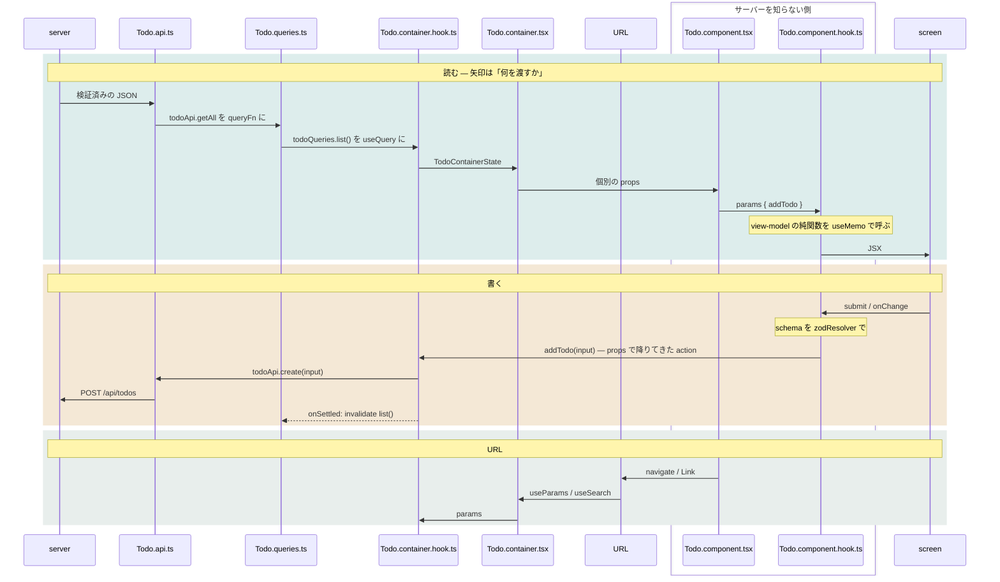

# Architecture

Container + Presentational Component, as Tolone settled it. This file is the whole guide.

## The shape

```
API → Queries → Container (+ container hook) → Component (+ component hook)
```

Two shared files per resource, then per page a Container and a Component, each with one
hook. The container hook holds server state. The component hook holds local UI state.
The Container itself holds nothing: it exists to call the container hook from outside the
Component, so the Component renders from props alone.

## The layers

In the order data reaches them.

| Layer | File | Purpose |
|---|---|---|
| API | `src/api/{Resource}.api.ts` | HTTP calls and contract types, generated from OpenAPI |
| Queries | `src/api/{Resource}.queries.ts` | `queryOptions()` factory: key, fetch function and shared options per query |
| Container hook | `{Page}.container.hook.ts` | Server state: `useQuery` and `useMutation`. One per page |
| Container | `{Page}.container.tsx` | Calls the container hook, reads the URL, passes fields to the Component as props |
| Component | `{Page}.component.tsx` | Rendering, loading UI, navigation. Calls the component hook |
| Component hook | `{Page}.component.hook.ts` | Local UI state, handlers, memoized view model |
| View model | `{Page}.view-model.ts` | Pure functions from contract types to display shapes. Only when the translation carries a decision |
| Form schema | `{Page}.schema.ts` | zod validation schema and the form-values type. Form pages only |

API and Queries live in `src/api/` and are shared by every page. The rest live in
`src/features/{feature}/{Page}/` and belong to that page.

## Data flow

```
read    server → API → Queries → container hook → Container → Component → component hook (+ view model) → screen
write   screen → component hook (+ form schema) → container-hook action → API → server
url     Component (navigate, Link) → URL → Container (useParams, useSearch) → container hook params
```

The same three flows, drawn. Each column is a layer; an arrow is what one layer hands
the next, so a column's incoming arrows are what it receives and its outgoing arrows are
what it hands on.



Container-hook actions reach the component hook as props through the Container. The
component hook never calls the container hook, and is called only inside the Component.
